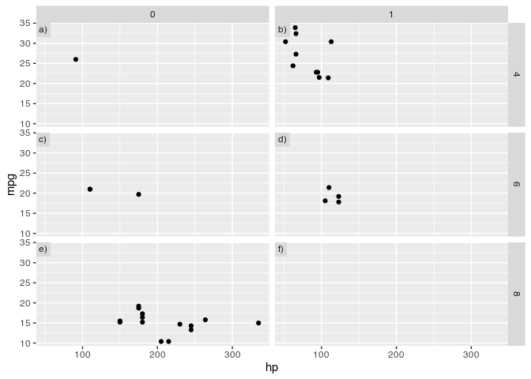

<!-- README.md is generated from README.Rmd. Please edit that file -->

# tagger

<!-- badges: start -->

<!-- badges: end -->

The goal of tagger is to easily add tags to facetted plots in order to
identify panles.

## Installation

<!-- You can install the released version of tagger from [CRAN](https://CRAN.R-project.org) with: -->

<!-- ``` r -->

<!-- install.packages("tagger") -->

<!-- ``` -->

You can install the development version from
[GitHub](https://github.com/) with:

``` r
# install.packages("devtools")
devtools::install_github("eliocamp/tagger")
```

## Example

In the default usage, you can simply add `tag_facets()` to add a tag to
each panel of a ggplo2 plot.

``` r
library(tagger)
library(ggplot2)

ggplot(mtcars, aes(hp, mpg)) +
   geom_point() +
   facet_grid(cyl ~ vs) +
   tag_facets()
```

<!-- --> If you want to tag rows
and columns instead of each panel indivdually, you can set it with the
`tag` argument.

``` r
ggplot(mtcars, aes(hp, mpg)) +
   geom_point() +
   facet_grid(cyl ~ vs) +
   tag_facets(tag = "rc")
```

<!-- -->
